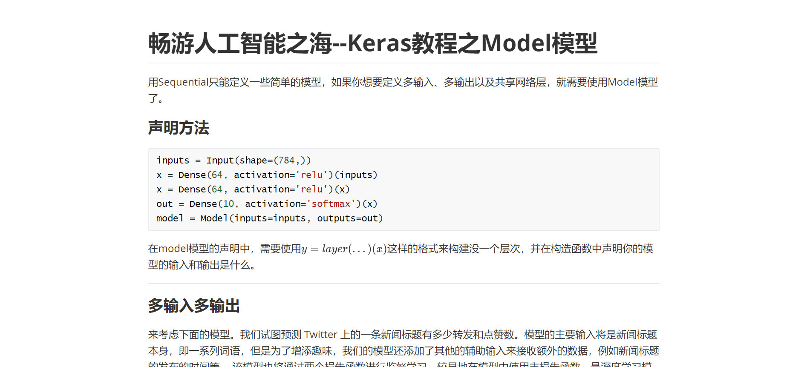
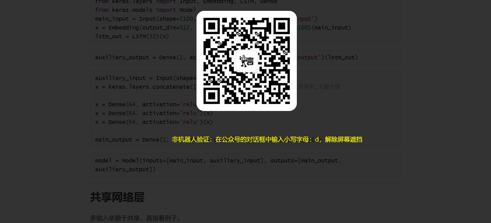
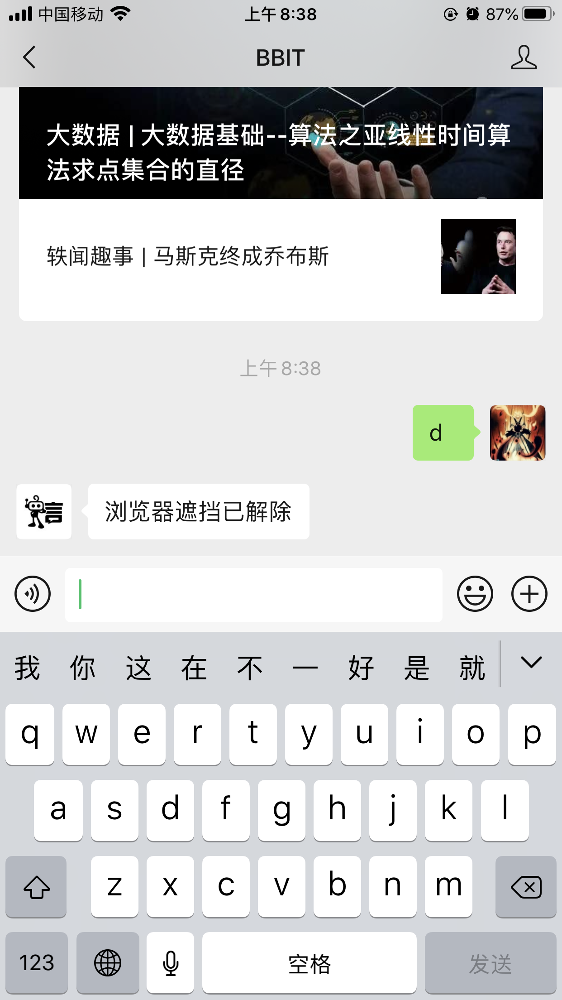
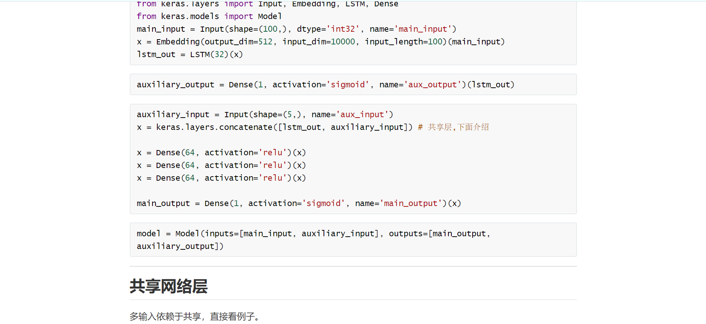

# 限制性阅读程序制作

### 开通微信公众号开发者模式

需要一个服务器，一个php程序开通，网上博客众多请自行查阅

### 制作web程序

将文章上传到自己的服务器，当用户在互联网上搜索到这篇文章并打开时，效果如下所示（附上实测网址：[ http://burningcloud.cn/article/20/index.html ]( http://burningcloud.cn/article/20/index.html )）

1. 


2. 


3. 


4. 


5. 


##### 实现方法

将自己写的文件转为html文件，然后在生成的代码中嵌入对应的代码块，该代码块负责弹出上述第二张图中所示的页面，同时后台监听用户是否关注了公众号，如果已经关注了，则可以将遮挡褪去。

核心代码如下所示：

```html
<script  type="text/javascript">
	function closeWindow(biaozhizifu){#该函数负责从服务器检测是否已经关注
						var biaozhi="0";
						var urlzifu="http://burningcloud.cn/ok.php?vcode="+biaozhizifu;
					    while(biaozhi=="0"){
							$.ajax({
							    url: urlzifu,
							    type: 'GET',
								async: false,
							    dataType: 'json',
							    data: {},
							    success: function(data){ 
									biaozhi=data;
							    },
							    error: function(xmlHttpRequest,textStatus,error){ 
							        console.log(xmlHttpRequest.status);
							        console.log(textStatus);
									console.log(1);
							    }
							});
						}
					$("#fade").fadeOut();
					$("#txt").fadeOut();
					$("#light_weixin").fadeOut();
				}
	$veried = false;
	$(window).scroll(function () {#该函数负责检测是否遮挡屏幕
		if ($veried == false && $(window).scrollTop() > 0.2 * ($(document).height() - $(window).height())) {
			$("#light_weixin").fadeIn();
			$("#txt").fadeIn();
			$("#fade").fadeIn(1000,function(){
				closeWindow(zifuchuan);
			});
			$veried = true;
		}
	});
</script>
```

